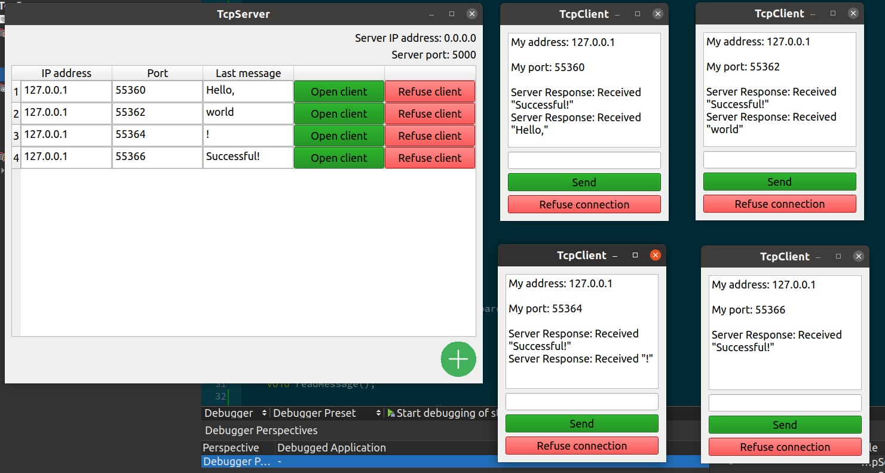

# STC_TEST_CASE
## TCP Server
### Install
Open .pro from TcpServer directory in QtCreator.
### Usage
You can create listeners for the server using the button in the lower right corner of the application.
You can open the client if you accidentally closed it with the "Open client" button.
The "Refuse client" button is needed to refuse the connection with a client.
In the listener window, you can send messages to the server, see the response from the server, and also have the ability to refuse the connection using the "refuse connection" button.
### Example

